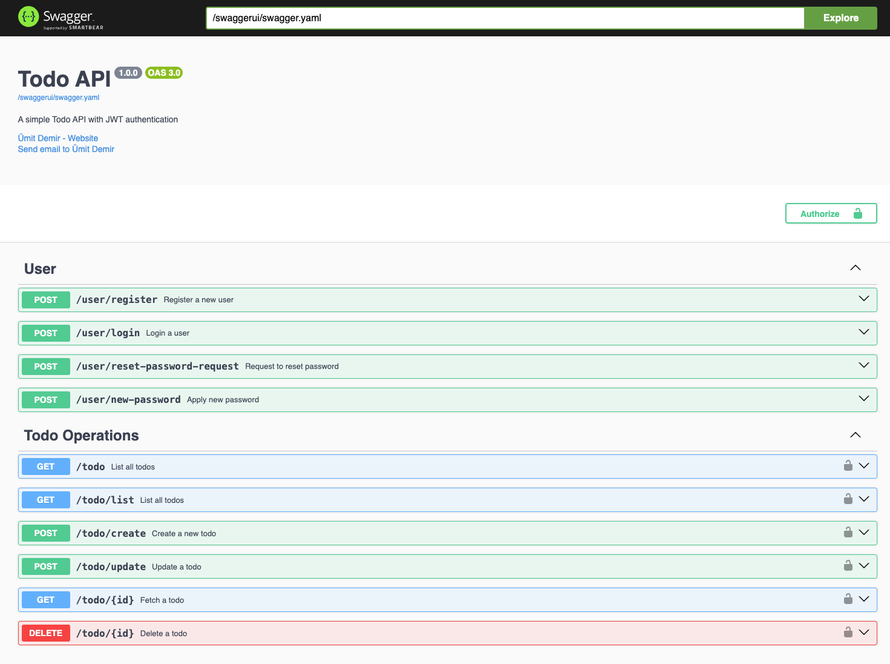

# Todo REST API

A basic REST API for todo app with PostgreSQL

## How to run

### Running with Docker

* Clone the repo
* Copy .env.sample to .env
* Run `docker-compose up --build`
* Go to [http://127.0.0.1:8080](http://127.0.0.1:8080)

### Running manually

* Clone the repo
* Copy .env.sample to .env
* Set postgres database URL with postgres variable in the env file
* Run `go mod download`
* Run `go build -o main`
* Run `./main`
* Go to [http://127.0.0.1:8080](http://127.0.0.1:8080)

## API Endpoints

| URL                                               | METHOD | Description                                     |
|---------------------------------------------------|--------|-------------------------------------------------|
| [/swaggerui/](http://127.0.0.1:8080/swaggerui/#/) | GET    | API documentation with Open API 3.0 and Swagger |
| [/todo/](http://127.0.0.1:8080/todo)              | GET    | Fetch all the todos                             |
| [/todo/list](http://127.0.0.1:8080/todo/list)     | GET    | Fetch all the todos                             |
| /todo/:id                                         | GET    | Fetch single todo                               |
| /todo/:id                                         | DELETE | Delete a todo                                   |
| /todo/create                                      | POST   | Creates a todo item with the given title prop   |
| /todo/update                                      | POST   | Updates a todo either with title or done props  |
| /user/register                                    | POST   | Register                                        |
| /user/login                                       | POST   | Login                                           |

## Lessons Learned

#### Project Structure
  * I created two packages for todo and user entities
  * repository.go files in these packages are responsible for database operations
  * service.go files in these packages are responsible for business logic
  * api.go files in these packages are responsible for handling requests and responses

#### Server Package
* I created server package for running the app
* In respond.go file, I created a helper function for responding to requests

#### Authentication and Authorization
  * Authentication and authorization with JWT in Go using [Argon2id](https://cheatsheetseries.owasp.org/cheatsheets/Password_Storage_Cheat_Sheet.html#argon2id) hashing algorithm which is the winner of the [Password Hashing Competition](https://en.wikipedia.org/wiki/Password_Hashing_Competition)
  * Tried to follow the best practices for authentication. See [OWASP Cheat Sheet](https://cheatsheetseries.owasp.org/cheatsheets/Authentication_Cheat_Sheet.html)
  * Used [github.com/golang-jwt/jwt/](https://github.com/golang-jwt/jwt/) for JWT parsing and generation
#### Email
  * I created email package for sending emails
  * I didn't want to use any third party email service for a simple todo app. Thanks to that, I learned how it's hard to handle email.
#### DB
  * I didn't want to use any ORM and migration tool since I wanted to learn how to do it manually in Go
  * Used [pgx](github.com/jackc/pgx) for PostgreSQL connection

#### Testing
  * I wrote some unit tests for email and user services
  * I've used [testify](https://github.com/stretchr/testify) for assertions and mocking

#### Other
* Used [gorilla/mux](https://github.com/gorilla/mux) for routing but I think I could have done it manually
* Used [zerolog](https://github.com/rs/zerolog) for logging
  * I chose zerolog because it's fast and easy to use